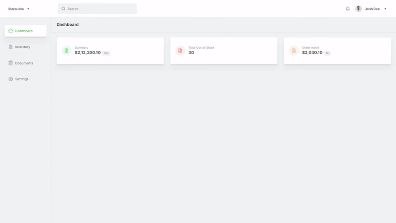

#

  
  <h1 align="center">Helps You Revive</h1>

## About

YogaVive is a local Yoga studio based on Khulna, Bangladesh. The owner reach out and ask me to build her a business landing page website for the small audiences she has, to promote her business as she has started taking her classes online, due to COVID-19. The main goal of this landing is to portrait what YogaVive stands for, what packages are available to join, what are the benefits, what results people got from YogaVive and of course the how to contact them.

## Instructions

To run the project locally you have to install **`Nodejs`** version 14+. Clone the project and run `npm install` from the root directory to install all the dependencies for the project. The below command are available to run:

- `yarn start` - Runs the app in the development mode. Open [http://localhost:3000](http://localhost:3000) to view it in the browser.

- `yarn build` - Builds the app for production to the `build` folder.\

- `yarn eject` - This command will remove the single build dependency from your project. (**Note: this is a one-way operation. Once you `eject`, you can’t go back!**)

## Preview

This application is live @ **[yogavivebd.com](https://yogavivebd.com)**. Also a preview of the application has been included below:

  

